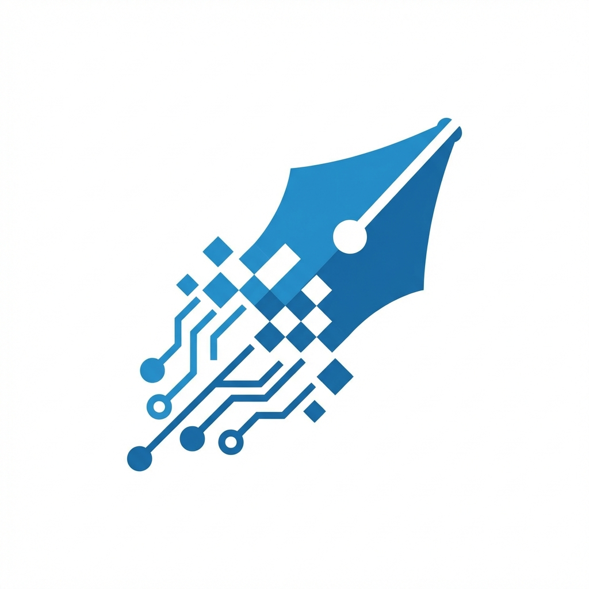

# Seshat

<p align="center">
  
</p>

**Application native macOS d'aide à la correction de copies manuscrites et à la création de devoirs**

---

> **Projet expérimental et open source en cours de développement actif.**
> Les fonctionnalités, l'API et l'interface peuvent changer significativement entre les versions.

---

## Origine du nom

**Seshat** (𓋇𓏏𓁐) est la déesse égyptienne de l'écriture, de la sagesse, des archives et des mesures. Dans la mythologie égyptienne, elle était la "Maîtresse de la Maison des Livres", gardienne des bibliothèques et des scribes. Elle est souvent représentée avec un papyrus et un roseau pour écrire.

Ce nom a été choisi pour cette application car, tout comme la déesse accompagnait les scribes dans leur travail d'écriture et d'archivage, Seshat accompagne les enseignants dans leur travail de lecture, de correction des copies manuscrites et de création de devoirs.

## Philosophie

> *"L'IA fait le gros du travail, l'humain supervise et valide."*

Seshat est un **assistant** pédagogique, pas un outil automatique. L'enseignant garde le contrôle à chaque étape du processus.

## Fonctionnalités (en développement)

### Correction de copies manuscrites

- **Import multi-source** : Glisser-déposer, Continuity Camera, PDF multi-pages
- **HTR (Handwritten Text Recognition)** : Reconnaissance d'écriture manuscrite avec MLX
- **Bounding boxes** : Localisation spatiale précise du texte sur la copie
- **Validation humaine** : Édition et correction de la transcription
- **Analyse linguistique** : Catégorisation automatique des erreurs (grammaire, vocabulaire, syntaxe, orthographe)
- **Export PDF** : Rapports annotés avec légende et statistiques

### Création de devoirs assistée par IA

- **Génération de questions** : Interface conversationnelle avec l'IA pour créer des questions
- **Types de questions variés** :
  - QCM (Questions à Choix Multiples)
  - Questions ouvertes
  - Vrai/Faux
  - Réponses courtes
- **Documents de contexte** : Ajoutez des textes ou images (avec OCR) pour guider la génération de questions pertinentes
- **Éditeur de questions** : Modifiez, réorganisez et personnalisez chaque question
- **Niveaux de difficulté** : Facile, Moyen, Difficile
- **Barème personnalisable** : Attribuez des points à chaque question
- **Aperçu en temps réel** : Visualisez le devoir tel qu'il sera imprimé
- **Export PDF** : Générez un PDF prêt à imprimer pour vos élèves

### Caractéristiques communes

- **100% local** : Conformité RGPD native, aucune donnée ne transite par internet
- **Apple Silicon optimisé** : Exploite le GPU Metal et le Neural Engine

## Avertissement

Ce projet est **expérimental** et en **développement actif**. Cela signifie :

- Des bugs peuvent survenir
- L'interface utilisateur peut changer
- Certaines fonctionnalités peuvent être incomplètes ou instables
- La documentation peut être en retard sur le code
- Les performances peuvent varier selon votre configuration

**N'utilisez pas cette application sans tests approfondis préalables.**

## Configuration requise

- **macOS 15.0 (Sequoia)** ou ultérieur
- **Apple Silicon** (M1, M2, M3, M4)
- 8 Go de RAM minimum (16 Go recommandés pour les modèles 7B)
- ~5 Go d'espace disque pour les modèles ML

## Installation

### Depuis les sources

```bash
# Cloner le dépôt
git clone https://github.com/your-username/Seshat.git
cd Seshat

# Ouvrir dans Xcode
open Seshat.xcodeproj

# Build (Cmd+B) puis Run (Cmd+R)
```

## Architecture technique

- **Langage** : Swift 5.9+ / SwiftUI
- **Pattern** : MVVM + Service Layer
- **ML** : MLX pour l'inférence locale sur Apple Silicon
- **HTR** : Stratégie de fallback multi-niveaux (Chandra 9B → DeepSeek-OCR-2 3B → Ollama → Mock)

## Structure du projet

```
Seshat/
├── Seshat/
│   ├── App/              # Point d'entrée et état global
│   ├── Models/           # Modèles de données
│   ├── Services/         # Services (HTR, Analysis, Export, TestCreation)
│   ├── Views/            # Vues SwiftUI
│   │   ├── Classroom/    # Gestion de classe
│   │   ├── CreateTest/   # Création de devoirs
│   │   ├── Transcription/# Transcription et validation
│   │   └── Export/       # Export PDF
│   └── Resources/        # Assets et ressources
├── Tools/                # Scripts utilitaires
└── Seshat.xcodeproj      # Projet Xcode
```

## Contribution

Les contributions sont les bienvenues ! Étant donné que le projet est en phase expérimentale, n'hésitez pas à :

- Signaler des bugs via les Issues GitHub
- Proposer des améliorations
- Soumettre des Pull Requests
- Partager vos retours d'utilisation

## Licence

Ce projet est distribué sous licence **CC BY-NC-SA 4.0** (Creative Commons Attribution - Pas d'Utilisation Commerciale - Partage dans les Mêmes Conditions 4.0 International).

**Vous êtes autorisé à :**
- **Partager** : copier et redistribuer le matériel sous quelque format que ce soit
- **Adapter** : remixer, transformer et créer à partir du matériel

**Selon les conditions suivantes :**
- **Attribution** : Vous devez créditer l'œuvre, intégrer un lien vers la licence et indiquer si des modifications ont été effectuées
- **Pas d'Utilisation Commerciale** : Vous n'êtes pas autorisé à faire un usage commercial de cette œuvre
- **Partage dans les Mêmes Conditions** : Si vous remixez, transformez ou créez à partir du matériel, vous devez diffuser vos contributions sous la même licence

Voir le fichier [LICENSE](LICENSE) pour les détails complets.

## Crédits et remerciements

- **Chandra** (Datalab) : Modèle HTR de référence pour l'écriture manuscrite
- **MLX** : Framework ML d'Apple pour Apple Silicon
- **Sparkle** : Framework de mise à jour automatique

---

*Seshat est un projet open source développé avec passion. Si vous l'utilisez et l'appréciez, n'hésitez pas à lui donner une étoile sur GitHub !*
